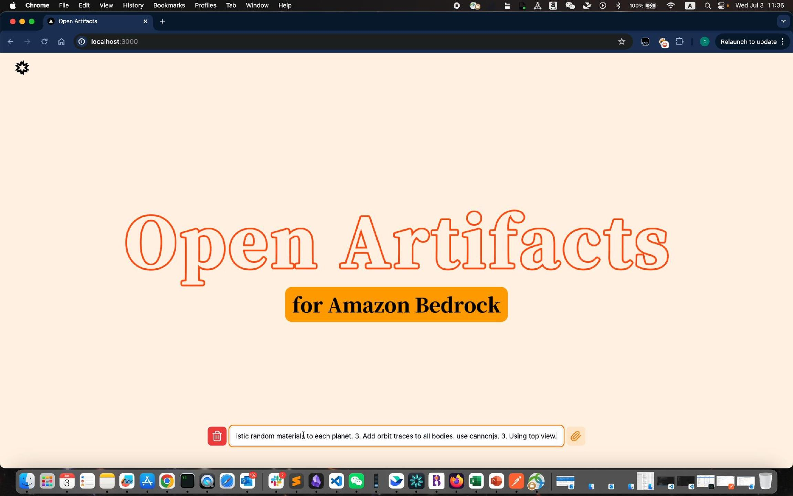
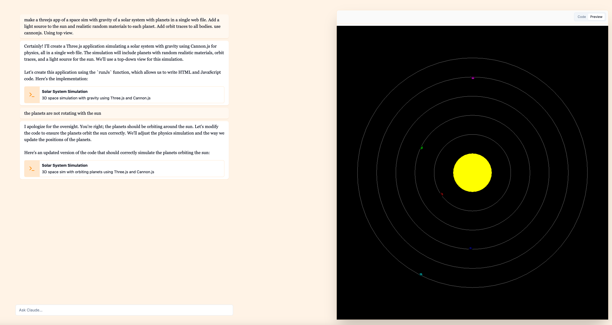
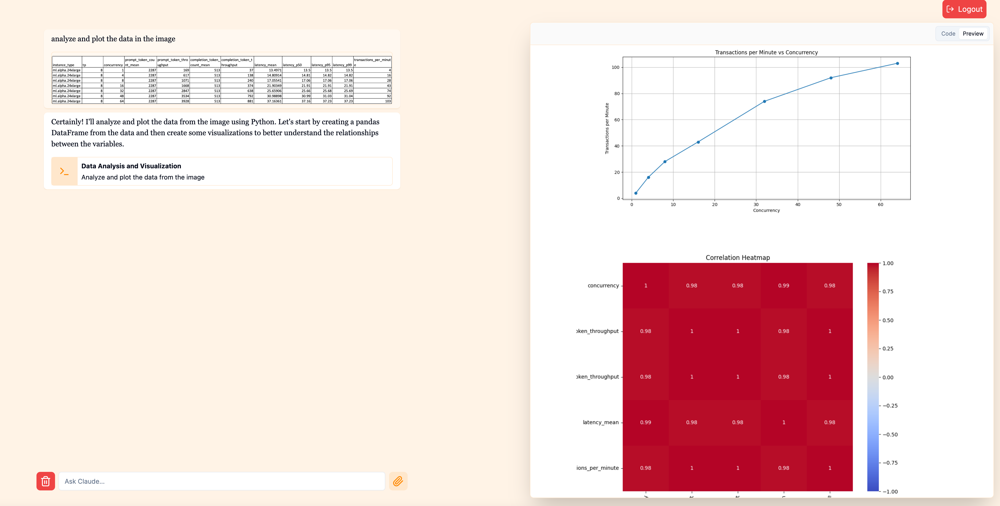
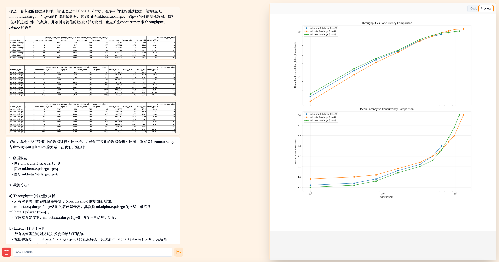
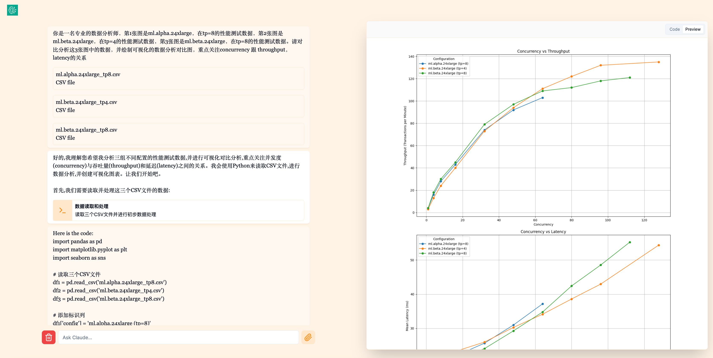
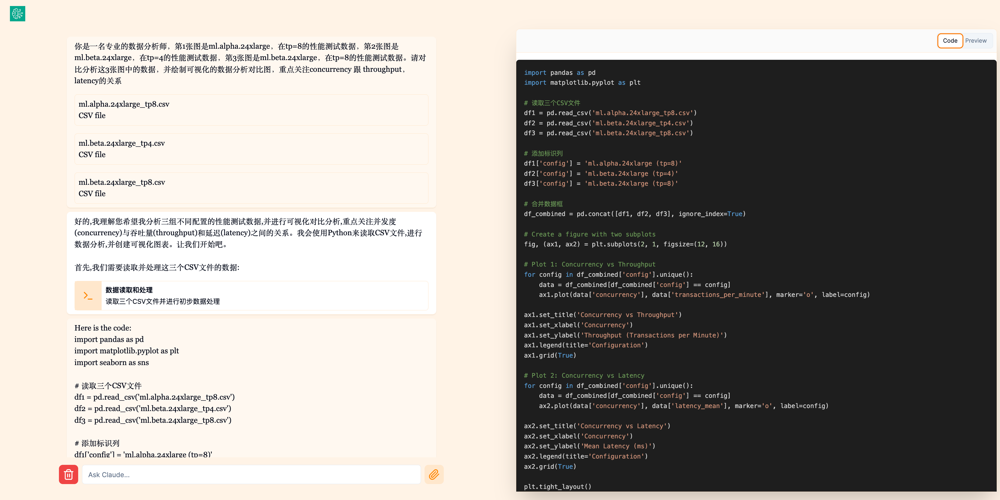
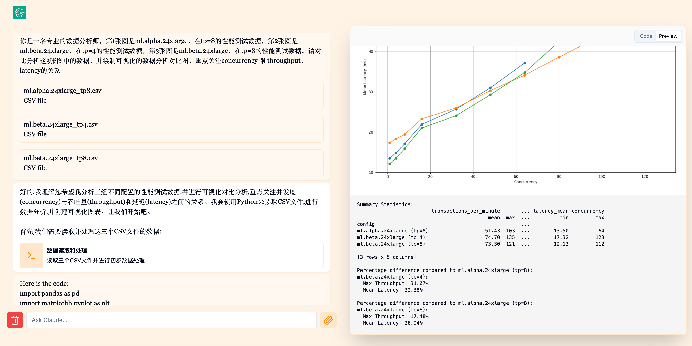

# Open Artifacts for Amazon Bedrock
[English](./README.md) | [中文](./README_zh.md)

## About Artifacts
Artifacts is a new feature introduced by Anthropic that expands the way users interact with the Claude model.
When users ask Claude to generate code snippets, text documents, or website designs, these artifacts appear in a dedicated window within their conversation.
Users can view, edit, and build Claude's creations in real-time, seamlessly integrating Claude-generated content into their projects and workflows.

## Introduction to this Open Source Artifacts Project
- This project uses [Vercel AI](https://sdk.vercel.ai/), an open-source large model application development framework for Next.js, utilizing Claude 3.5 on Amazon Bedrock, and draws inspiration from examples in [e2b](https://e2b.dev/docs) to recreate an open-source version of Anthropic's Artifacts UI functionality. It interacts with the Claude model through a code interceptor component, generating corresponding code, text, and design content, then executes and returns interactive results using a locally built sandbox image.
- The main features currently include:
1. Support for Bedrock Claude 3.5 integration
2. Direct use of locally created docker images as sandboxes, ensuring data privacy and security, improving development convenience and execution performance.
3. Support HTML/JS frontend rendering, allowing generation of HTML/JS code that can be directly rendered in the browser and support real-time interaction.
4. Support multimodal capabilities, e.g., uploading spreadsheets screenshots, PDF screenshots, and generating code for data visualization analysis.
4. Support uploading CSV spreadsheets and generating code to read the file directly for data analysis.
5. Other features such as simple user login/logout, clearing context, copying and pasting to directly upload images, etc.


## Video Demo
[](https://youtu.be/KqqVYtA_X-8)
## Environment Preparation
- Can be set up in a local Mac environment or on an Amazon EC2 instance (Amazon Linux 2023 is recommended), a CPU instance is sufficient, no GPU instance required
1. Install nodejs and yarn
```bash
sudo yum install https://rpm.nodesource.com/pub_18.x/nodistro/repo/nodesource-release-nodistro-1.noarch.rpm -y
sudo yum install nodejs -y --setopt=nodesource-nodejs.module_hotfixes=1 --nogpgcheck
sudo npm install --global yarn
```
2. Install & start docker (skip if already installed)
```bash
sudo yum install docker -y
sudo service docker start
sudo chmod 666 /var/run/docker.sock
```
## Usage Instructions
### 1. Configure docker image
1. Enter open_artifacts/docker_files
```bash
cd open_artifacts/docker_files
```

2. Open a terminal in this folder (containing Dockerfile) and run the following command to build the Docker image:
```bash
docker build -t python3.10 .
```
This command will create a Docker image named python3.10. If you need to install a specific Python version or other dependencies, you can modify the Dockerfile.

### 2. Configure .env, set AK SK, and enable permissions 
1. Create a .env file in the open_artifacts directory with the following content:  
The default username and password is admin/admin, can you can change them via setting in .env file.  
If you did not set the AWS_ACCESS_KEY_ID or AWS_SECRET_ACCESS_KEY, then you need to bind a IAM role to your EC2.
```
AWS_ACCESS_KEY_ID=*******
AWS_SECRET_ACCESS_KEY=******
AWS_REGION=us-east-1
PYTHON_DOCKER_IMAGE=python3.10
MODEL_ID=anthropic.claude-3-5-sonnet-20240620-v1:0
USERNAME=
PASSWORD=
```

2. (Optional) In case you want to use IAM role instead of AK/SK
- IAM Role's permission
Create a new IAM role with name artifacts-service-role and settings below:
   - Trusted entity type: AWS Service
   - Service: EC2
   - Use Case: EC2 - Allows EC2 instances to call AWS services on your behalf.

Skip "Add permission" and create this role first.
After the role is created, and then add permission by creating inline policy as below:
```json
{
    "Version": "2012-10-17",
    "Statement": [
        {
            "Sid": "VisualEditor0",
            "Effect": "Allow",
            "Action": [
                "bedrock:*",
            ],
            "Resource": "*"
        }
    ]
}
```
Finally, Bind this IAM instance profile (IAM Role) to your EC2 instance.


2. If running locally, execute the following. Upon successful execution, it will open the local UI port 3000. Access via http://localhost:3000
```bash
yarn
yarn dev
```
- If using on a cloud host, you need to open port 3000, access via http://ip:3000
```bash
yarn dev -- -H 0.0.0.0
```

## Demo
### Snake Game
- Step by step prompt 
```
1. Create an automatic snake game, be cool and fancy
2. Change the background color to black
3. Add some fireworks background, etc.
4. Add a starry sky background image
```


### Solar System Simulation
```
make a threejs app of a space sim with gravity of a solar system with planets in a single web file.
the planets should be orbiting around the sun. Add a light source to the sun and realistic random materials to each planet. Add orbit traces to all bodies. use cannonjs. Using top view.
```


### Data Visualization Analysis (Visual QA)
#### case 1
- Upload image (You can also directly copy and paste the image into chat input box)


- Prompt
```
analyze and plot the data in the image 
```

- Result


#### case 2
- Upload images 1, 2, 3


- Prompt
```
You are a professional data analyst. The first image is performance test data for ml.alpha.24xlarge with tp=8, the second image is for ml.beta.24xlarge with tp=4, and the third image is for ml.beta.24xlarge with tp=8. Please compare and analyze the data in these 3 images, and create a visualized data analysis comparison chart, focusing on the relationship between concurrency, throughput, and latency.
```

- Result


### Data Visualization Analysis (File QA)
- Download CSV files,and upload in one shot 
* [ml.alpha.24xlarge_tp8.csv](asset/ml.alpha.24xlarge_tp8.csv)  
* [ml.beta.24xlarge_tp4.csv](asset/ml.beta.24xlarge_tp4.csv)  
* [ml.beta.24xlarge_tp8.csv](asset/ml.beta.24xlarge_tp8.csv)

- Step by step Prompt
1. 
```
You are a professional data analyst. The first image is performance test data for ml.alpha.24xlarge with tp=8, the second image is for ml.beta.24xlarge with tp=4, and the third image is for ml.beta.24xlarge with tp=8. Please compare and analyze the data in these 3 images, and create a visualized data analysis comparison chart, focusing on the relationship between concurrency, throughput, and latency.
```
2. 
```
Please continue analyzing.
```
3. If you encounter excution error, you just need to copy and past the error log to the chat input box, and the AI will continue to fix it.

- Result
* 
* 
* 

### Generate Architecture Diagram
```
create an web server architecture diagram using aws loadbalancer, ec2, rds
```
```
add api gateway between lb and web servers, and put the servers in vpc
```
```
it errors : No module named 'diagrams.aws.apigateway'\n
```


### Architecture Conversion Between Different Clouds
- Prompt
```
explain the architecture in the image, and alternate all the services to aws services accordingly and draw aws architecture diagram
```
- Upload image

- Result


## Others
### FAQ
1. How to ensure all dependencies for running code are met?
You can check the error messages returned by the frontend code execution page to see if any modules are missing. If missing, you can modify the docker_files/Dockerfile file, add the corresponding packages, and then build:
```bash
docker build -t python3.10 .
```

2. Running in the background with PM2
```bash
#install pm2
sudo yarn global add pm2
pm2 start pm2run.config.js 
```
- Below are more commands for managing artifacts with PM2:
```bash
pm2 list
pm2 stop artifacts
pm2 restart artifacts
pm2 delete artifacts
```


