# Open Artifacts for Amazon Bedrock
[English](./README.md) | [中文](./README_zh.md)

## 关于Artifacts
Artifacts是Anthropic推出的一项新功能，它扩展了用户与Claude模型的互动方式。
当用户要求Claude生成代码片段、文本文档或网站设计等内容时，这些工件会出现在他们对话的专用窗口中。
可以实时查看、编辑和构建Claude的创作，将claude生成的内容无缝集成到他们的项目和工作流程中

## 本开源Artifacts项目简介
- 本项目采用 [Vercel AI](https://sdk.vercel.ai/) 一个next.js开源的大模型应用开发框架，使用Amazon Bedrock上的Claude 3.5，并借鉴了[e2b](https://e2b.dev/docs) 中的example，复刻一个开源版本的Anthropic的Artifacts UI功能，它通过code intereptor组件与Claude模型交互，生成相应的代码，文本及设计内容，然后通过本地build的sandbox镜像执行并返回交互式的结果。
- 目前主要功能特点如下：
1. 支持Bedrock Claude 3.5接入
2. 直接使用本地自己制作的docker image作为sandbox，保证数据隐私和安全，提高开发便捷性，执行性能。
3. 新增支持HTML/JS 前端渲染功能，可以生成HTML/JS代码，直接在浏览器渲染，并可以支持实时交互。
4. 新增图片上传加入多模态能力，例如可以上传excel表格，pdf截图，并生成代码做数据可视化分析。
5. 其他小功能，例如清除上下文，复制粘贴直接上传图片等

## 视频Demo
* 公众号 [复刻Open Artifacts](https://mp.weixin.qq.com/s/HsMAkLHsWNrkfsp9N11bVA)
* Youtube English version
[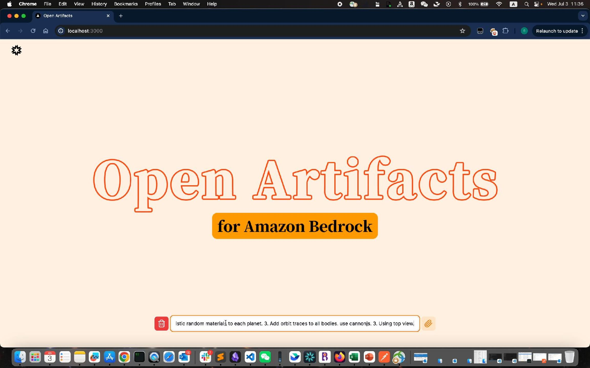](https://youtu.be/y6n1t-3OUNw)


## 环境准备
- 可以在本地mac环境或者Amazon EC2实例(推荐Amazon Linux 2023)，CPU机型即可，无需GPU实例
1. 安装nodejs和yarn
```bash
sudo yum install https://rpm.nodesource.com/pub_18.x/nodistro/repo/nodesource-release-nodistro-1.noarch.rpm -y
sudo yum install nodejs -y --setopt=nodesource-nodejs.module_hotfixes=1 --nogpgcheck
sudo npm install --global yarn
```
2. 安装 &启动 docker(如有可调过)
```bash
sudo yum install docker -y
sudo service docker start
sudo chmod 666 /var/run/docker.sock
```
## 使用说明
### 1. 配置docker image
1. 进入open_artifacts/docker_files
```bash
cd open_artifacts/docker_files
```

2. 在本文件夹下（包含 Dockerfile） 的目录中打开终端，运行以下命令来构建 Docker 镜像：
```bash
docker build -t python3.10 .
```
这个命令会创建一个名为 python3.10 的 Docker 镜像。如果需要安装某个特定的 Python 版本，或者需要安装其他依赖，则可以在Dockerfile 中进行修改。

### 2. 配置.env, 设置AK SK，并开通权限
1. 在open_artifacts目录下创建一个：.env文件，内容如下（请在环境变量中配置用户密码，默认用户密码admin/admin）:
```
AWS_ACCESS_KEY_ID=*******
AWS_SECRET_ACCESS_KEY=******
AWS_REGION=us-east-1
PYTHON_DOCKER_IMAGE=python3.10
MODEL_ID=anthropic.claude-3-5-sonnet-20240620-v1:0
USERNAME=
PASSWORD=

2. 如果在本地启用执行，执行成功会打开本地3000的ui端口. 通过http://localhost:3000访问
```bash
yarn
yarn dev
```
- 如果在云端主机使用，需要打开3000端口,通过http://ip:3000访问
```bash
yarn dev -- -H 0.0.0.0
```

## 效果演示
### 贪吃蛇
```
1. 创建一个自动的贪吃蛇游戏, be cool and fancy
2. 更换背景颜色为黑色
3. 放一些烟花背景等
4. 增加星空背景图
```
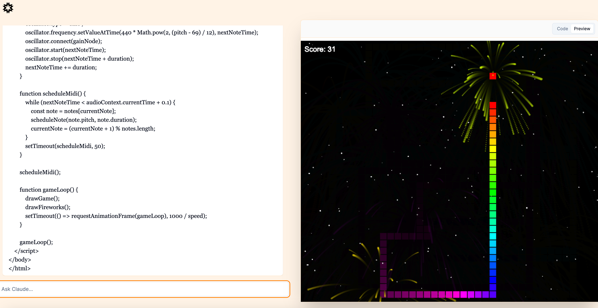

### 模拟太阳系
```
make a threejs app of a space sim with gravity of a solar system with planets in a single web file.
the planets should be orbiting around the sun. Add a light source to the sun and realistic random materials to each planet. Add orbit traces to all bodies. use cannonjs. Using top view.
```
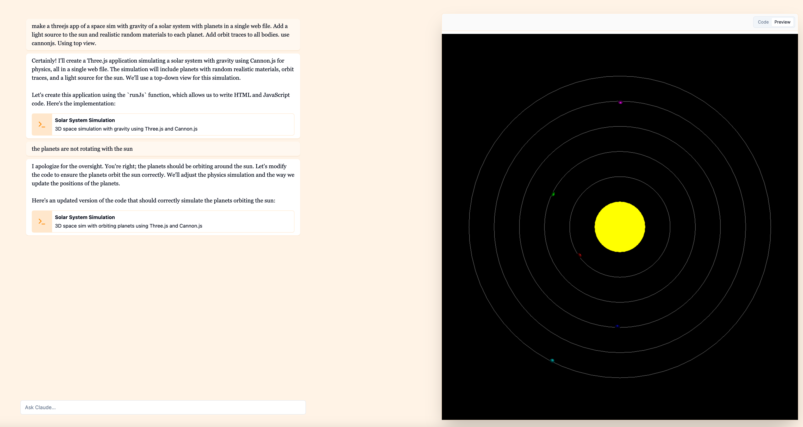

### 数据可视化分析（图片分析）
#### case 1
- 上传图片1(可复制并粘贴进对话框)
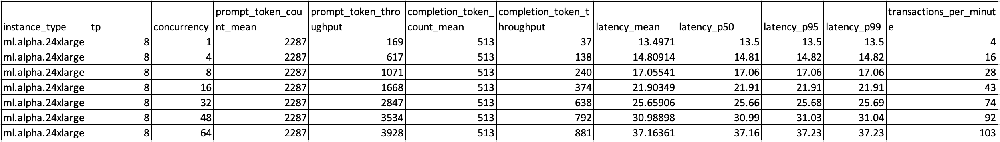

- 提示词
```
analyze and plot the data in the image 
```

- Result
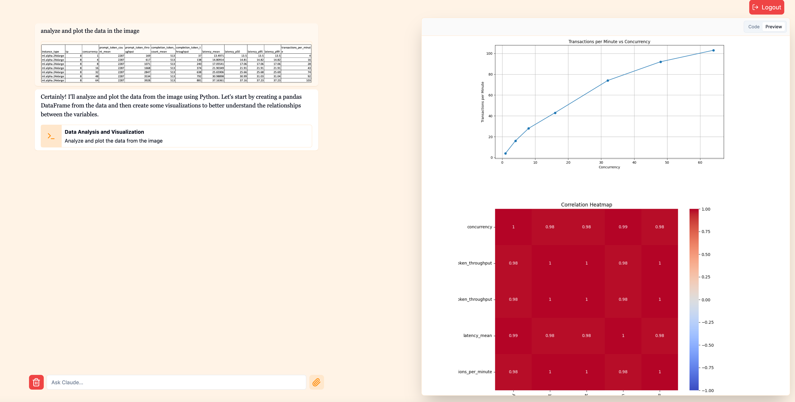


#### case 2
- 上传图片1，2，3

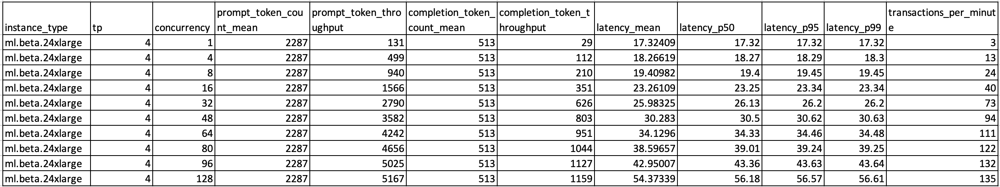
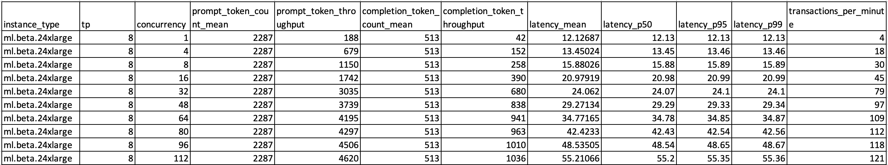

- 提示词
```
你是一名专业的数据分析师，第1张图是ml.alpha.24xlarge，在tp=8的性能测试数据，第2张图是ml.beta.24xlarge，在tp=4的性能测试数据，第3张图是ml.beta.24xlarge，在tp=8的性能测试数据。请对比分析这3张图中的数据，并绘制可视化的数据分析对比图，重点关注concurrency 跟 throughput，latency的关系
```

- 结果
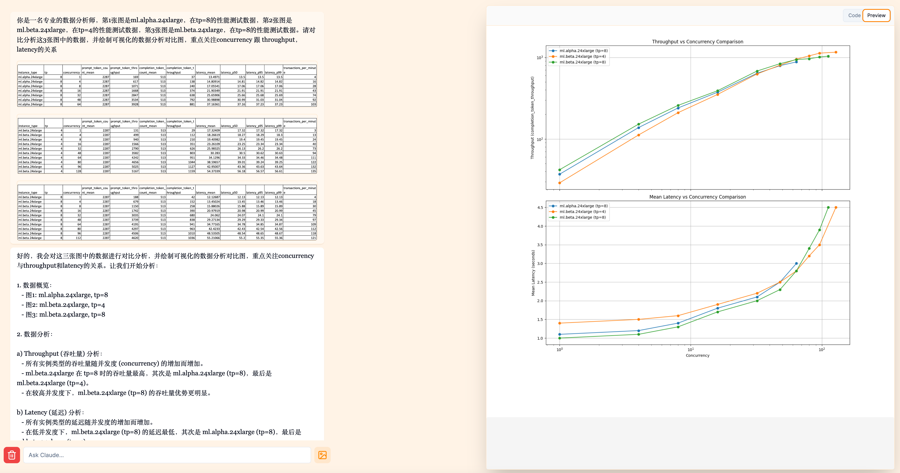


### python 数据可视化分析（上传csv文件分析）
- 下载以下文件到本地，并从聊天窗口同时上传3个csv文件
* [ml.alpha.24xlarge_tp8.csv](asset/ml.alpha.24xlarge_tp8.csv)  
* [ml.beta.24xlarge_tp4.csv](asset/ml.beta.24xlarge_tp4.csv)  
* [ml.beta.24xlarge_tp8.csv](asset/ml.beta.24xlarge_tp8.csv)

- 提示词
1. 
```
你是一名专业的数据分析师，第1张图是ml.alpha.24xlarge，在tp=8的性能测试数据，第2张图是ml.beta.24xlarge，在tp=4的性能测试数据，第3张图是ml.beta.24xlarge，在tp=8的性能测试数据。请对比分析这3张图中的数据，并绘制可视化的数据分析对比图，重点关注concurrency 跟 throughput，latency的关系
```
2. 
```
请继续分析
```
3. 如果碰到执行错误，则将错误信息复制进入输入框，再次点击执行

- 最终结果
* 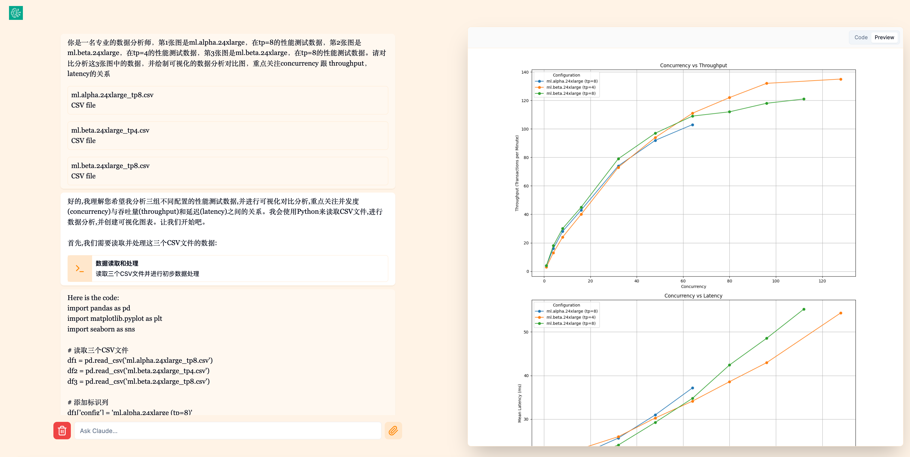
* 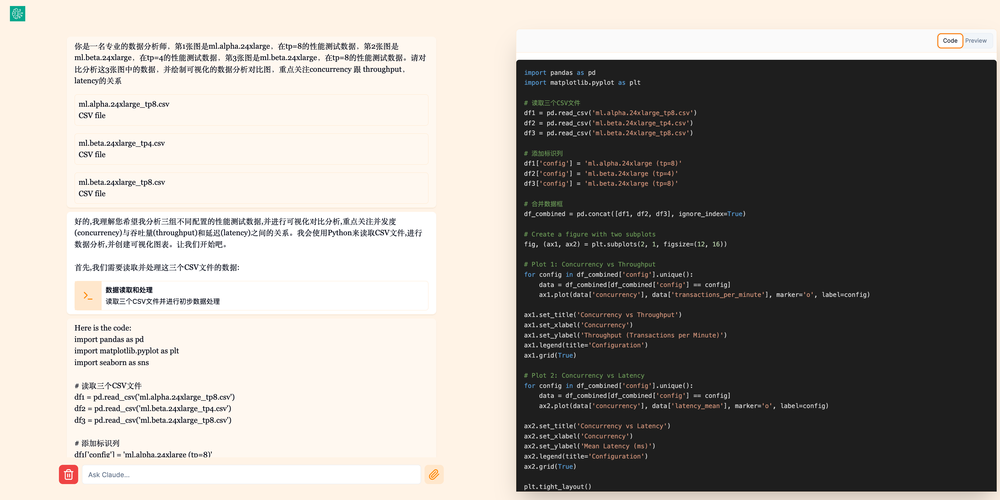
* 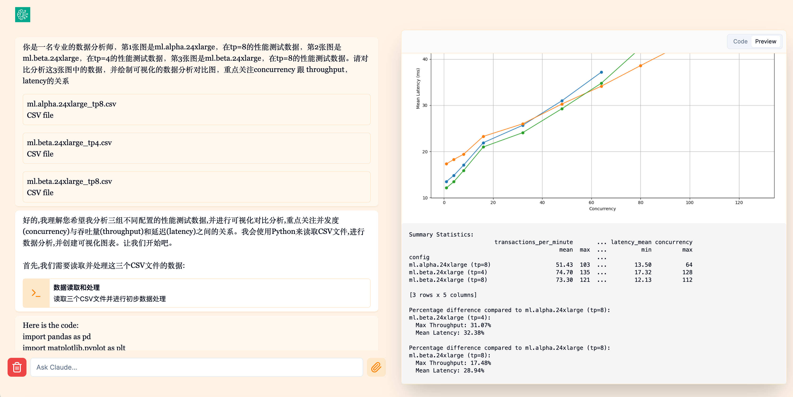

### 生成架构图
```
create an web server architecture diagram using aws loadbalancer, ec2, rds
```
```
add api gateway between lb and web servers, and put the servers in vpc
```
```
it errors : No module named 'diagrams.aws.apigateway'\n
```
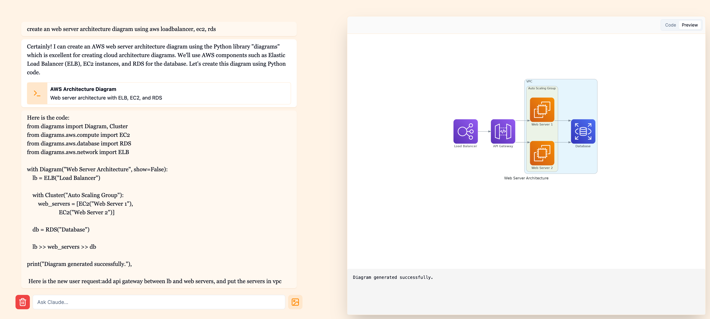

### 不同云只之间的架构转换
- 上传图片
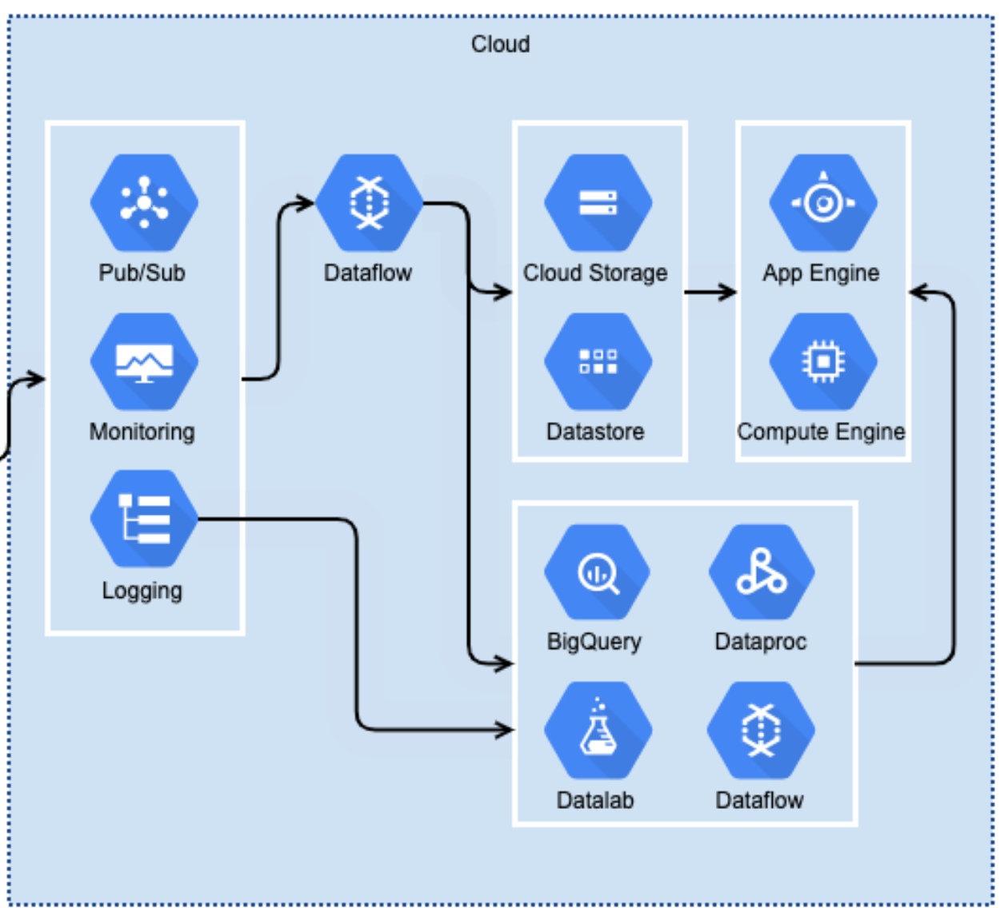

- 提示词
```
explain the architecture in the image, and alternate all the services to aws services accordingly and draw aws architecture diagram
```

- 结果
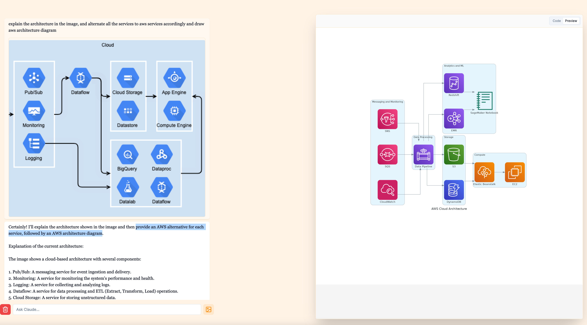

## 其他
### FAQ
1. 如何保证运行代码的依赖都能满足？
可以根据前端代码执行页面返回的报错信息，查看是否缺少module，如果缺少可以修改docker_files/Dockerfile文件，添加对应的包，然后build即可
```bash
docker build -t python3.10 .
```

2. 使用PM2后台运行
```bash
#install pm2
sudo yarn global add pm2
pm2 start pm2run.config.js 
```
- 以下是其他的管理命令:
```bash
pm2 list
pm2 stop artifacts
pm2 restart artifacts
pm2 delete artifacts
```

